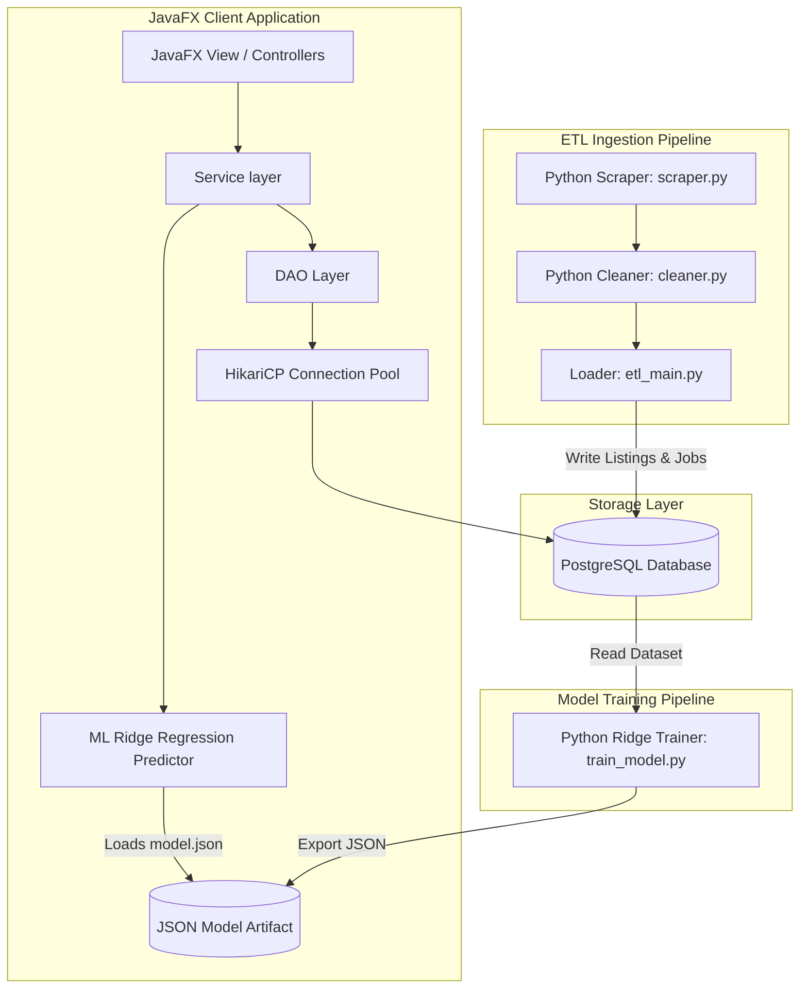

# LOCUS Analytics - Real Estate Analytics Platform

LOCUS Analytics is a comprehensive data analytics and valuation desktop application tailored for the real estate markets of Pakistan (specifically targeting Karachi, Lahore, and Islamabad). Built as a JavaFX application with a PostgreSQL database, an integrated Python ETL scraping pipeline, and Ridge Regression machine learning models, LOCUS provides actionable investment insights, heatmaps, and fair market value estimates.

---

## Repository Architecture

This repository is structured as a monorepo containing the desktop client application, database DDL schemas, data ingestion tools, and machine learning models.



---

## Project Structure

```
Locus-Analytics-/
├── locus-analytics/
│   ├── schema.sql                      # PostgreSQL DDL script
│   ├── schema_oracle.sql               # Oracle SQL compatibility script
│   ├── etl_pipeline/                   # Python Data Ingestion Service
│   │   ├── scraper.py                  # Real estate web listing scraper
│   │   ├── cleaner.py                  # Data cleaning and standardization
│   │   ├── etl_main.py                 # Core ETL entry point with state log updates
│   │   └── requirements.txt
│   └── locus-analytics/                # Java Desktop Client (Maven Project)
│       ├── pom.xml                     # Maven project configuration
│       ├── src/
│       │   ├── main/
│       │   │   ├── java/com/locus/     # Java Source Files
│       │   │   │   ├── config/         # HikariCP database config
│       │   │   │   ├── dao/            # Data Access Objects (CRUD)
│       │   │   │   ├── ml/             # ML prediction model execution
│       │   │   │   ├── model/          # POJOs and DTOs
│       │   │   │   ├── service/        # Business logic validation
│       │   │   │   └── ui/             # JavaFX controllers and widgets
│       │   │   └── resources/
│       │   │       ├── fxml/           # 14 JavaFX screen UI layouts
│       │   │       └── config.properties # Database & API credentials
│       │   └── test/
│       │       └── java/com/locus/     # JUnit 5 Service Unit Tests
│       ├── data/
│       │   └── generate_seed.py        # Seed scripting for initial data populate
│       ├── ml/
│       │   ├── train_model.py          # Machine learning model training script
│       │   ├── retrain_model.py        # Ridge model retrain comparison script
│       │   └── model.json              # Saved Ridge model weights
│       └── scripts/
│           ├── backup.sh               # Linux DB backup script
│           └── backup.bat              # Windows DB backup script
├── LOCUS_DOC_24I0640_24I0663_24I0517.pdf # System Architecture Document
├── LOCUS_Analytics_Codebase_Report.pdf  # Codebase documentation
├── LOCUS_Project_Presentation.pptx     # Slide deck presentation
├── Schema.pdf                          # Database Relational Schema
└── domain_model.png                    # System Domain Model diagram
```

---

## Core Features

### 1. Advanced Analytics & Estimators
- **Fair Market Value (FMV) Estimator**: Predicts property value using location, size, property type, and rooms using a Ridge regression machine learning model.
- **Rental Yield Calculator**: Computes annual rental yields and flags high-yield investment options.
- **ROI Calculator**: Computes expected Return on Investment (ROI) based on holding period, capital gains, and inflation.
- **Price Trends**: Generates historical price charts segmented by city and property size.
- **Investment Clusters**: Discovers highly profitable neighborhoods by clustering ROI/yield performance.

### 2. Live ETL Pipeline
- Scrapes real-estate data dynamically and pipes it into the PostgreSQL engine.
- Filters duplicates using unique URL hashes.
- Tracks real-time pipeline progress with live percentage completion bars in the Admin dashboard.

### 3. Administrative Capabilities
- **Direct Database Backups**: Auto-runs database dump scripts with rolling backups.
- **Audit Logs**: Database trigger-based log history tracking all critical record mutations.
- **Listing Management**: Complete CRUD interfaces for managing active property details.

---

## Tech Stack

### Client
- **Java JDK 17**: Core language runtime.
- **JavaFX 21**: Desktop UI library with modular CSS styling.
- **HikariCP**: High-performance database connection pooling.
- **Maven**: Dependency resolution and build runner.
- **JUnit 5**: In-memory unit test verification.
- **OpenPDF**: Real-estate valuation PDF generator.

### Database & Ingestion
- **PostgreSQL 15+**: Relational storage engine.
- **Python 3.10+**: ETL pipeline development and model execution.
- **psycopg2-binary / Pandas**: Pipeline processing tools.
- **Scikit-learn**: Model training (Ridge Regression).

---

## Getting Started

For step-by-step setup guides, database configuration details, model training procedures, and project running instructions, please refer to the detailed [locus-analytics/locus-analytics README](locus-analytics/locus-analytics/README.md).

---

## Development Team

- **Fasih Ul Mubashir** (24i-0517) - System Engineer (Backend, DB, ETL, Deployment)
- **Arham Manzoor** (24i-0640) - Lead Data Scientist (Domain Model, Services, ML)
- **Ayaan Aman** (24i-0663) - Frontend Architect (JavaFX UI, Charts, Maps, PDF Reports)
